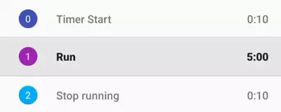

# Tips and Tricks

## Table of Contents

- [Music behavior positioning](#Music-behavior-positioning)
- [Tweak time quickly](#Tweak-time-quickly)
- [Double tap step number to jump to it](#Double-tap-step-number-to-jump-to-it)
- [Long click step number to edit it](#Long-click-step-number-to-edit-it)

## Music behavior positioning

It's designed to play short reminded sound and not to handle too many music playback cases. If you wish to listen to some relaxing music, please use a music app.

## Tweak time quickly

After enabling [Advanced Time Tweak] in the app settings, in the timer screen, you can tweak time by just pressing the tweak button, moving the finger to a time and releasing the finger. This is quicker than tapping twice.

## Double tap step number to jump to it

## Long click step number to edit it

It's similar to the previous tip, just press and hold the step number to open the dialog box for editing step.
