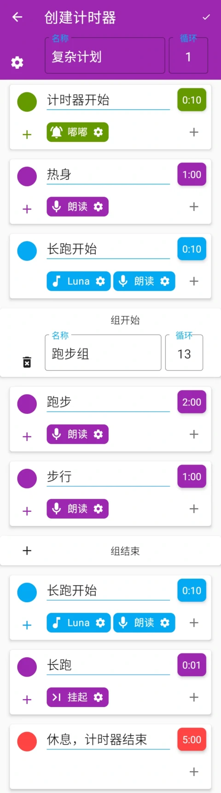
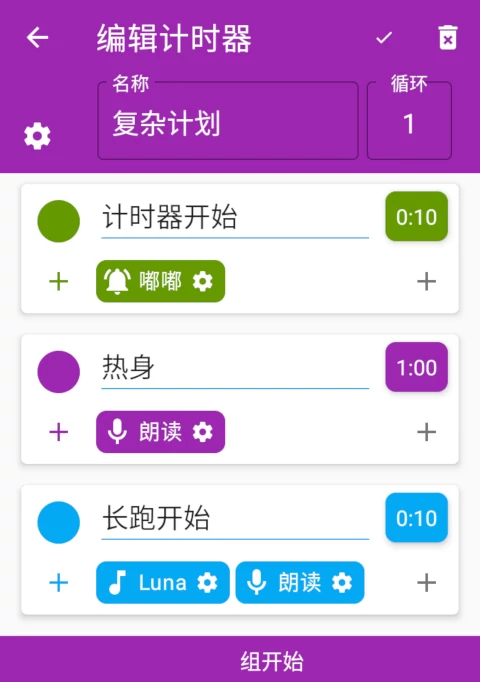
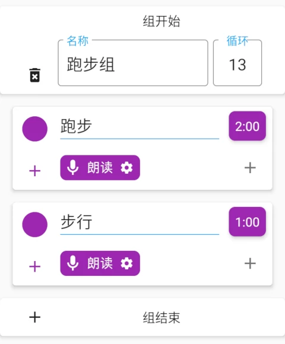
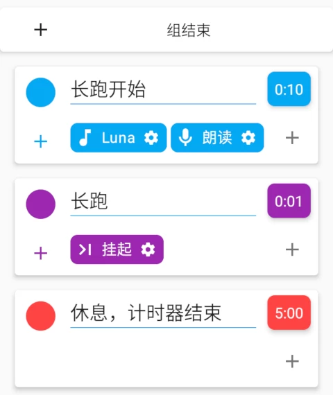
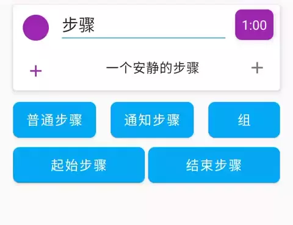
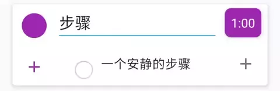
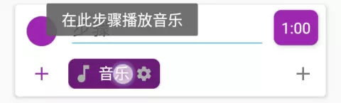

# 计时机器的使用指南

> 复杂的事情需要复杂的应用。

本文非常努力地介绍了计时机器的使用方法。

## 目录

1. [基本概念](#基本概念)
1. [计时器例子](#计时器例子)
1. [界面使用示范](#界面使用示范)
1. [与循环计时器的不同](#与循环计时器的不同)
1. [遇到问题请发邮件吧](#遇到问题请发邮件吧)

## 基本概念

1. 计时器

    此应用中的“计时器”不是传统意义上的计时器，而是包含多个单独计时器和循环次数的一组任务。

1. 步骤

    代表了要在一定时间内完成一件事。

1. 行为

    是一个步骤的一部分。表示在这个步骤运行时，手机以什么方式提醒你。

    - **没有行为的步骤只会安静地计时，然后安静地进入下一步。为了在步骤结束时得到提醒，请添加一个有行为的步骤。**
    - 已有的行为：音乐、振动、屏幕（弹出提醒界面）、挂起（停留在此步骤等待手动下一步）、朗读（朗读步骤名称）、嘟嘟（每秒播放嘟嘟音）

## 计时器例子

参考几个例子，各位就肯定能快速上手这个应用。

### 1. 简单的小例子

这是一个循环3次的跑步+步行的锻炼计划。

有特殊颜色的步骤出现啦。第一个步骤和最后一个步骤分别是

> 起始和结束步骤：一个计时器可以循环多次，而这两个步骤是整个计时器开始和结束的标志，只会在整个计时器的开始和结束时各执行一次。

这里的“计时器开始”和“计时器结束”这两个步骤提醒我们整个锻炼计划的开始和结束。它们有着音乐等行为，不然我们是无法知道什么时候开始和结束的。

接下来是一个“跑步”步骤，它没有任何行为，只是简单地计时，但在它之后，有一个“通知步骤”：

> 通知步骤：是一个方便的用于提醒的步骤。
> - 会保存每次编辑后的内容，并在下一次添加通知步骤时显示相同的内容。
> - 在通知步骤微调时间时，计时器会退回上一步骤，并把时间设置为1分钟（设置中可关闭）。

这样我们就知道什么时候跑步结束，该进入下一步的“步行”了。

因为计时器有三次循环，这个计时器将会在3次跑步+提醒+步行+提醒后进入结束步骤，计划完成🎉

### 2. 复杂的小例子

这是一个热身+13次跑步和休息的循环+长跑+休息的复杂计划。

注意到计时器的循环是1次，这是因为整个计划并不能简单地分割为多次循环，而需要更精细地控制。

首先是起始步骤和热身步骤，它们有着朗读、嘟嘟等行为。它们之后并没有通知步骤，这是因为这些行为会在步骤开始时运行一次，可以用于简单地提醒我们一个新的步骤开始了（你也可以专门添加一些通知步骤）。

接下来的通知步骤告诉我们一个“组"开始啦：

> 组：算是一个计时器中的小计时器，有着自己的名字和循环，并可以包含多个步骤。

这里我们把跑步+休息的两个步骤放到一个组里，设置循环为13次。

在一个组结束后，我们设置了一个有挂起行为的步骤。因为不知道长跑的具体时间，所以让个步骤挂起（永久停留在此步骤等待手动下一步），等待长跑结束后，手动下一步。

> 挂起行为会让计时停止，让计时器的时长失效。

最后的结束步骤充当了休息步骤。

## 界面使用示范

- 添加步骤

    

    

- 删除步骤

    

- 添加行为

    

- 编辑行为

    

- 长按步骤/行为查看其解释

    
    

## 与循环计时器的不同

1. 循环计时器已经停止维护，但开发任务并没有停止，计时机器是其继承者/下一代。

2. 在循环计时器中，每个步骤之后的提醒是自动的、全局的，不需要手动添加的。而在计时机器中，需要手动添加一个有行为的步骤，不然是不会得到任何反馈的。

## 遇到问题请发邮件吧

可以通过应用内【反馈与帮助】-滑动到底部-【反馈】或[点击这里](mailto:ligrsidfd@gmail.com)发送邮件。通常会在24小时内得到回复。
